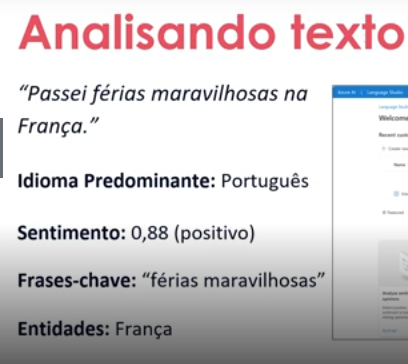
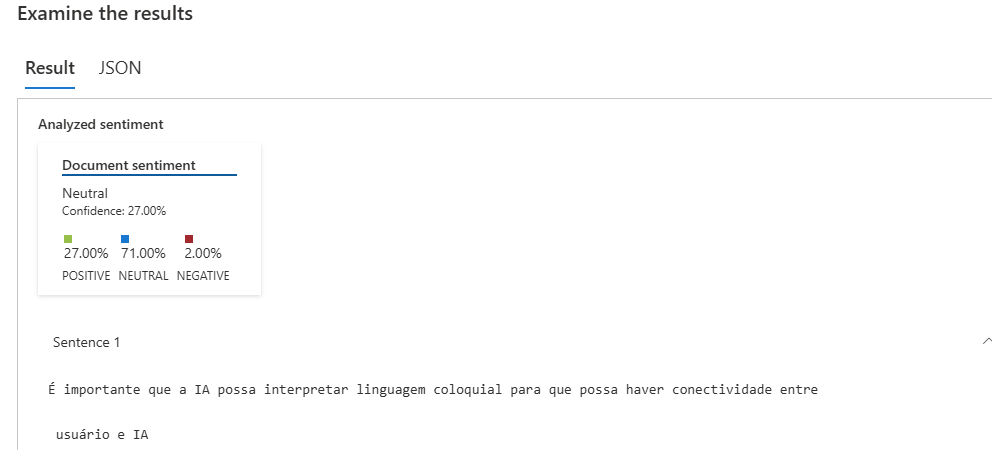

# Processamentos de Linguagem Natural

## Sumário

- [Processamentos de Linguagem Natural](#processamentos-de-linguagem-natural)
  * [O que é?](#o-que)
  * [IA Conversacional no Azure](#ia-conversacional-no-azure)
    + [Linguagem](#linguagem)
      - [NER (Reconhecimento de Entidade Nomeada)](#ner-reconhecimento-de-entidade-nomeada)
      - [Detecção de PII e PHI](#detec-o-de-pii-e-phi)
        * [PII (Personally Identifiable Information)](#pii-personally-identifiable-information)
        * [PHI (Protected Health Information)](#phi-protected-health-information)
      - [Detecção de idiomas](#detec-o-de-idiomas)
      - [Análise de Sentimentos](#an-lise-de-sentimentos)
      - [Respostas e Perguntas](#respostas-e-perguntas)
    + [Fala](#fala)
      - [Texto para fala](#texto-para-fala)
      - [Conversão de fala para texto](#convers-o-de-fala-para-texto)
      - [Tradução de fala](#tradu-o-de-fala)
    + [Tradução (diferente da fala)](#tradu-o-diferente-da-fala)

## O que é?

- Análise de texto (palavras-chave, datas, informações relevantes)
- Análise de sentimento (ofensivo, amoroso) -> entender o público
- Tradução automática

## IA Conversacional no Azure

### Linguagem

#### NER (Reconhecimento de Entidade Nomeada) 

- Separação de informações em entidades
- Bom para pesquisas de mercado

#### Detecção de PII e PHI

##### PII (Personally Identifiable Information)

- Informações que podem identificar uma pessoa
- LGPD, política de privacidade

##### PHI (Protected Health Information)

- Informações de saúde do indivíduo

#### Detecção de idiomas

- Identificar idiomas 
- Tradução

#### Análise de Sentimentos

- Interpretação de sentimentos
- Opiniões ou avaliações sobre um serviço

#### Respostas e Perguntas

- Atendimento

### Fala

#### Texto para fala

- Acessibilidade
- Texto convertido em fala ou vice-versa

#### Conversão de fala para texto

- Transcrição
- Legendas automáticas

#### Tradução de fala

- Tradução de fala

### Tradução (diferente da fala)

- Conteúdos que devem ser traduzidos
- Tradução do texto
- Tradução de documentos

# Análisando Texto:

Nesse exemplo, é possível visualizar como as entidades são separadas e como uma frase pode ser interpretada por uma IA

## Compreensão da linguagem coloquial

- É importante que a IA possa interpretar linguagem coloquial para que possa haver conectividade entre usuário e IA

- Identifica pela intenção

- Receber, entender e executar

- Utilizar recursos de falas

## Análise de sentimentos

