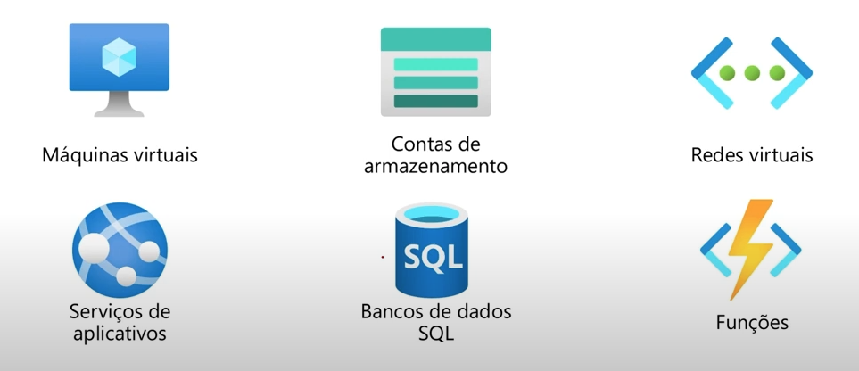
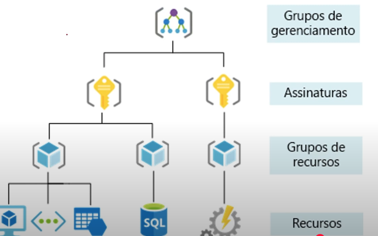
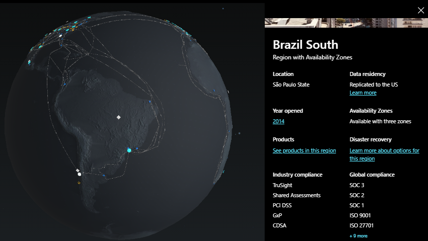
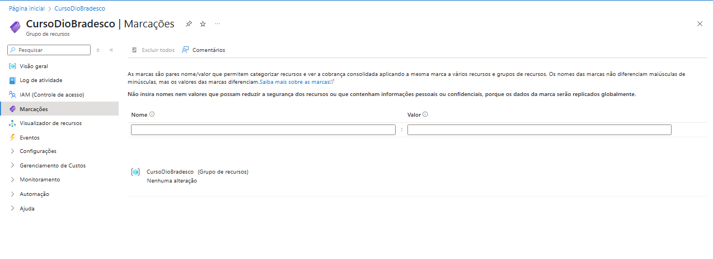
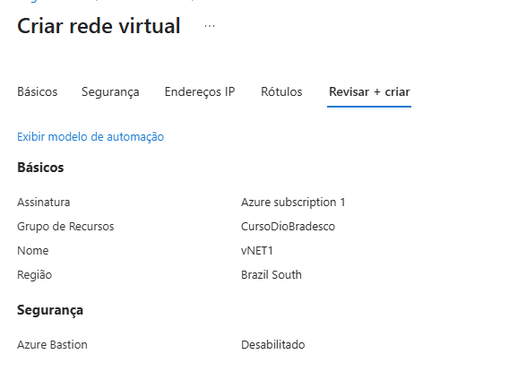

  # Componentes de Arquitetura 

  ## Sumário:
  * [Regiões](#regioes)
  * [Zonas de Disponibilidade](#zonas-de-disponibilidade)
  * [Pares de Regiões](#pares-de-regioes)
  * [Regiões Soberanas](#regioes-soberanas)
  * [Recursos do Azure](#recursos-do-azure)
    + [Grupo de recursos](#grupo-de-recursos)
  * [Assinaturas](#assinaturas)
  * [Grupos de gerenciamento](#grupos-de-gerenciamento)
  * [Hierarquia de grupos de recursos](#hierarquia-de-grupos-de-recursos)
- [Criando no Azure](#criando-no-azure)
  * [Globo de regiões do Azure](#globo-de-regioes-do-azure)
  * [Criando grupo de recursos](#criando-grupo-de-recursos)
  * [Criando uma rede virtual](#criando-uma-rede-virtual)

---

## Regioes 

> Podemos criar recursos em qualquer lugar

- Região disponível
- Região anunciada
- Zona de disponibilidade

Alguns recursos são específicos para determinadas regiões.
O MicroSoft Azure tem uma grande abrangência global (mais de 60 regiões)

> Regiões são formadas por um grupo de DataCenters

> Cada região deve garantir redução de latência e alta performance

> Garante responsabilidade com os dados que são transmitidos naquele ambiente

## Zonas de Disponibilidade

- Fornece proteção contra tempo de inatividade
- Separação física dos datacenters da região
- Equipamento adequado para os datacenters

## Pares de Regioes

- Regiões secundárias em caso de queda
- Replicação automática para alguns serviços

## Regioes Soberanas

- Regiões restritas (como governamental dos EUA e Azure China)

## Recursos do Azure

### Grupo de recursos

- Organização e separação de recursos 
- Gerenciamento em uma única unidade de vários recursos
- Recursos existem em apenas um grupo, e em regiões diferentes
- Recursos podem ser movidos entre grupos

## Assinaturas

- Uma conta pode ter diversas assinaturas mas uma assinatura está associada apenas a uma conta 
- Organização do pagamento (separando entre asinaturas diferentes) 
- Limite de cobrança
- Limite de autorizações

## Grupos de gerenciamento

- Padrões para mais de uma assinatura
- Assinaturas herdam as condições dos grupos de gerenciamento

## Hierarquia de grupos de recursos 

1- Grupos de Gerenciamento  
2- Assinaturas  
3- Grupo de recursos   
4- Recursos  

# Criando no Azure

### Globo de regioes do Azure

### Criando grupo de recursos

### Criando uma rede virtual

