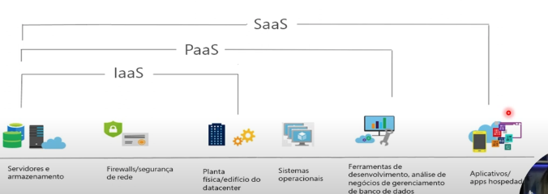
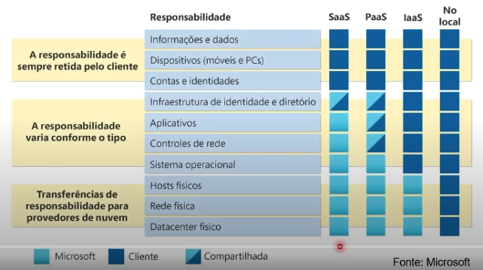

# Tipos de serviço Cloud

> Provedor x Cliente

> Casos de uso

### Iaas (infraestrutura como serviço)
- Mais utilizado
- Cliente se envolve mais
- Mais acesso ao recurso final
- Maior personalização (consequentemente maior responsabilidade do cliente)

### Paas (plataforma como serviço)
- Menor envolvimento
- Sem preocupação com o servidor, e mais com a aplicação
- SO não é mais responsabilidade do cliente

### Saas (software como serviço)
- Teams e Office 365 por exemplo
- Acesso reduzido para menor responsabilidade
- Modelo de licenciamento

### On Premises
- Total responsabilidade do cliente
> Refere-se a um modelo de TI em que a infraestrutura, como servidores, sistemas e dados, são instalados e gerenciados dentro das próprias instalações de uma empresa, em vez de estarem alojados em um ambiente externo como a nuvem
## Modelo de Responsabilidade Compartilhada

> Alguns dos recursos sempre são responsabilidade do cliente.

> Os que variam conforme o tipo, dependem do tipo de serviço

> Alguns sempre são responsabilidade dos provedores nos tipos de serviço

Resumo:

IasS -> controle do hardware, mais flexível
PaaS -> aplicativos, 
SaaS -> licenciamento, pagamento pelo software

## Criação de Máquina Virtual:

