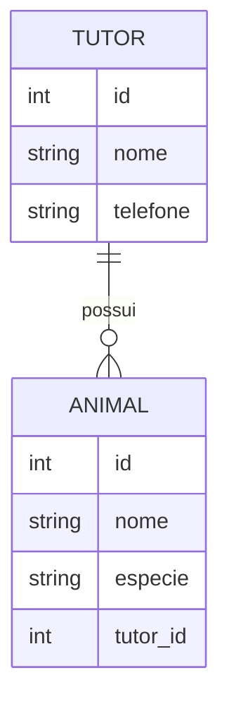

```mermaid
erDiagram
    TUTOR ||--o{ ANIMAL : possui

    TUTOR {
        int id
        string nome
        string telefone
    }

    ANIMAL {
        int id
        string nome
        string especie
        int tutor_id
    }

```